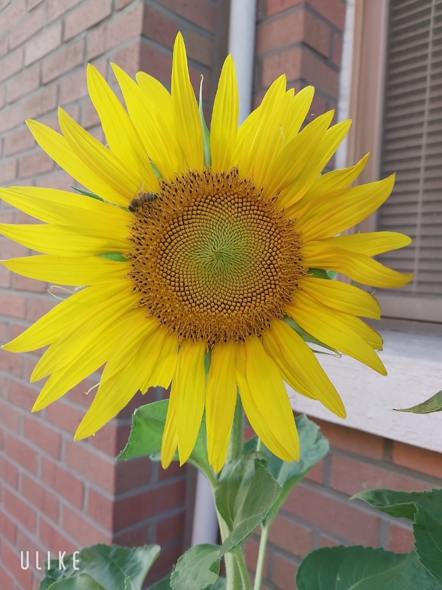

# hello-world
it 테스터 과정

markdown language - 글 서식 편집용 언어
# 반려동물
## 강아지와 해바라기 보여주는 화면입니다.

### 해바라기

###반려동물 시스템 발표자료
.[글씨].(주소)
.[네이버검색].(https://www.naver.com). 
.[동물병원시스템].(https://github.com/parkgyehee/hello-world). 
.[발표자료].(/project.pptx). 

> 들여쓰기
> >한번더 들여쓰기
> > 두번 들여쓰기
> >
1. 첫번째 메뉴
2. 두번째 메뉴
3. 세번째 메뉴

### 유튜브
<iframe width="1000" height="500" src="https://www.youtube.com/embed/m--MXud9XdI" title="[최신가요 실시간 인기차트] 2025년 10월 19일 3주차, 멜론차트 X, 차트둥이 공식채널, 노래모음 KPOP 플레이리스트 종합차트" frameborder="0" allow="accelerometer; autoplay; clipboard-write; encrypted-media; gyroscope; picture-in-picture; web-share" referrerpolicy="strict-origin-when-cross-origin" allowfullscreen></iframe>

## 🎵 유튜브

> 📺 [최신가요 실시간 인기차트] 2025년 10월 19일 3주차  
> 클릭하면 유튜브에서 바로 재생됩니다 🎶
>
> 
안녕하세요
박계희입니다
